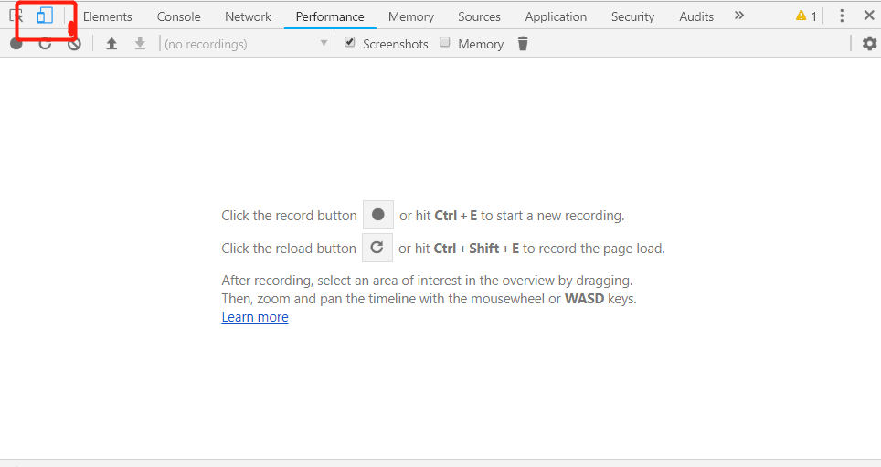

# 安装部署说明

## 1. Front end

1.1 从Github上Clone项目

```
git clone 'https://github.com/SYSU-BronzeTiki/BronzeTiki-FE.git'

```

1.2 设置后台部署所提供的IP，如 http://119.29.13.173:8080，打开文件"/BronzeTiki-FE/config/index.js"，将下图中的target字段替换为相应的IP。


1.3 在项目根目录'/BronzeTiki-FE'下，安装项目依赖项

```
npm install

```

1.4 运行前端项目

```
npm run start

```
1.5 在Chrome浏览器打开 http://locahost:8080，按F12，点击调试界面左上角切换至移动端模式。



## 2. Back End

1.1 从Github上Clone项目

```
git clone 'https://github.com/SYSU-BronzeTiki/BronzeTiki-Server.git'

```

1.2 整合前端

采用github项目中的dist文件夹或者使用以下命令build前端得到dist文件夹放到后端项目中

```
npm run start

```

1.3 测试运行

```
python app.py

```

1.4 部署到nginx

安装uwsgi和nginx

uwsgi配置：

```
[uwsgi]
#http=0.0.0.0:8081
socket=127.0.0.1:8081
pythonpath=/home/ubuntu/BronzeTiki/BronzeTiki-Server/
wsgi-file=/home/ubuntu/BronzeTiki/BronzeTiki-Server/app.py
callable=app
touch-reload=/home/ubuntu/BronzeTiki/BronzeTiki-Server/
processes = 4
threads = 2
stats = :9191
master = true
pidfil = /home/ubuntu/BronzeTiki/myapp_uwsgi.pid
daemonize = /home/ubuntu/BronzeTiki/log/myapp_uwsgi.log
vacuum = true
```

使用命令启动uwsgi：
```
uwsgi --ini BronzeTiki_uwsgi.ini
```

nginx配置：

```
server {
    listen       8080;
    server_name  119.29.13.173; # the real address of server

    #charset koi8-r;
    access_log  /home/ubuntu/BronzeTiki/log/nginx_access.log;
    error_log  /home/ubuntu/BronzeTiki/log/nginx_error.log;

    location / {
        include uwsgi_params;
        uwsgi_pass 127.0.0.1:8081;
    }
}
```

其中uwsgi_param文件：
```
uwsgi_param  QUERY_STRING       $query_string;
uwsgi_param  REQUEST_METHOD     $request_method;
uwsgi_param  CONTENT_TYPE       $content_type;
uwsgi_param  CONTENT_LENGTH     $content_length;

uwsgi_param  REQUEST_URI        $request_uri;
uwsgi_param  PATH_INFO          $document_uri;
uwsgi_param  DOCUMENT_ROOT      $document_root;
uwsgi_param  SERVER_PROTOCOL    $server_protocol;
uwsgi_param  REQUEST_SCHEME     $scheme;
uwsgi_param  HTTPS              $https if_not_empty;

uwsgi_param  REMOTE_ADDR        $remote_addr;
uwsgi_param  REMOTE_PORT        $remote_port;
uwsgi_param  SERVER_PORT        $server_port;
uwsgi_param  SERVER_NAME        $server_name;
```

其中nginx即可通过8080端口访问。
