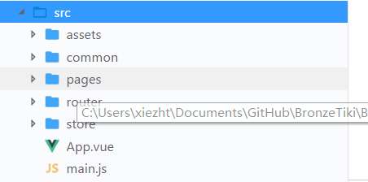
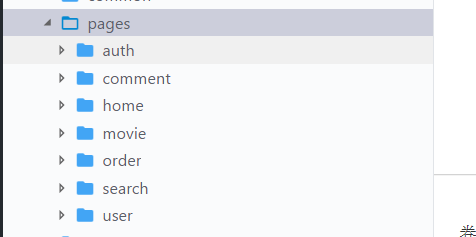

# 软件设计文档

> 使用《系统分析与设计》的课程项目

项目采取了前后端分离的设计思路，分为前端和后端两个项目。

## 1. Front-End

### 1.1 技术选型

前端采用的技术栈：

* webpack：项目构建打包

    Webpack 是一个开源的前端打包工具。Webpack 提供了前端开发缺乏的模块化开发方式，将各种静态资源视为模块，并从它生成优化过的代码。

* vue：类MVVM的渐进式Javascript框架

    Vue是一套用于构建用户界面的渐进式框架，被设计为可以自底向上逐层应用。Vue 的核心库只关注视图层，不仅易于上手，还便于与第三方库或既有项目整合。当与现代化的工具链以及各种支持类库结合使用时，Vue 也完全能够为复杂的单页应用提供驱动。

* vue-router：单页应用前端路由
* vuex：应用数据状态管理

    vue-router 和 vuex 是官方提供的前端路由和数据状态管理的库，能够完美地结合 Vue 框架，实现前端路由和应用数据状态管理，代码结构清晰，程序复杂度降低。应用数据状态管理也采取了单例模式的思想，优化了应用的内存占用情况。

* axios：ajax异步请求工具库

    
    axios 是一个基于 promise 的工具库，使用这个库可以给服务端发送 ajax 请求。由于这个库基于 promise，使得我们在处理异步请求的时候不需要嵌套回调函数，代码架构上有了极大优化，可维护性更高。

* Element：UI框架

    Element是一套为开发者、设计师准备的基于 Vue 2.0 的桌面端组件库。该框架封装了多种 UI 组件，使用方便，能够快速上手，应用到Vue项目中。

### 1.2 架构设计

根据前端项目所涉及的界面设计、业务逻辑以及项目配置构建的需求，我们使用vue-cli搭建项目的基本架构。


* build：运行提供开发环境和构建项目的代码
* config：项目的webpack打包配置、http代理配置
* src：项目的源代码
* static：项目的静态文件、测试文件

具体到src包的结构，如下图：



其相应的功能为：

* assets：图标、字体文件等静态资源
* common：公共组件、工具函数
* router：前端路由
* store：部分数据状态
* APP.vue：应用入口

### 1.3 模块划分

参照最初[页面设计](https://github.com/SYSU-BronzeTiki/Documents/blob/master/doc/Design.md#1-ui%E8%AE%BE%E8%AE%A1)及其相应的跳转关系，我们将页面划分为以下几个组件




相应的页面组件及其子组件的功能如下：

```
├─pages：存放所有的页面组件
│  ├─auth：登录注册相关的组件
│  │      SignIn.vue：登录页面组件
│  │      SignUp.vue：注册页面组件
│  │
│  ├─comment：评论相关组件
│  │      comment.vue：评论页面组件
│  │
│  ├─home：首页相关组件
│  │  │  Home.vue：首页页面组件
│  │  │
│  │  └─components：首页页面子组件
│  │          Header.vue
│  │          MovieList.vue
│  │
│  ├─movie：电影相关组件
│  │  │  MovieDetail.vue：电影详情页面组件
│  │  │  Screen.vue：电影场次页面组件
│  │  │  Seat.vue：电影座次页面组件
│  │  │
│  │  └─components
│  ├─order：订单相关组件
│  │  │  OrderConfirm.vue：订单确认页面组件
│  │  │  OrderDetail.vue：订单详情页面组件
│  │  │  OrderList.vue：订单列表页面组件
│  │  │
│  │  └─components
│  ├─search：搜索组件
│  │      Search.vue：搜索页面组件
│  │
│  └─user：用户个人中心相关组件
│      │  Record.vue
│      │  ResetPassword.vue：重置密码页面组件
│      │  ResetPayPassword.vue：重置支付密码页面组件
│      │  UploadAvatar.vue：上传头像页面组件
│      │  UserInfo.vue：用户个人信息页面组件
│      │  UserInfoSetting.vue：用户信息修改页面组件
│      │
│      └─component：用户页面子组件
│              Header.vue：页面头部
│              RecordList.vue：记录列表组件

```

### 1.4 设计模式

* 发布订阅模式：由 Vue 框架本身实现。应用的数据变化会自动影响到引用了该数据的界面，促使界面发生更新，主要使用的设计模式即发布订阅模式。

* 单例模式：应用中部分数据从视图层抽离，放到一个应用全局的位置进行管理（使用Vuex的store），所有页面使用的都是同一份数据。当数据更新的时候所有引用到数据的界面也会同步更新。


* 面向对象编程：应用中使用了面向对象编程的封装思想，按照业务逻辑将代码的各个模块进行了封装。如router。router 封装了路由配置信息，在界面的业务逻辑代码中通过 $router 对象可以控制界面跳转。


## 2. Back-End

### 2.1 技术选型

后端采用的技术栈：

* Flask：一款python的Web后端框架

    Flask 是一个开源的Python实现的Web开发微框架。 Flask 旨在保持核心的简单而易于扩展，可以灵活选择数据库等扩展功能。

* MySQL：后端数据库

    MySQL 是一个关系型数据库管理系统。 MySQL 是开源的，使用标准的SQL数据语言形式，支持Python语言，是最流行的Web应用关系数据库管理系统软件。

* SQLAlchemy：后端采用的ORM(对象关系映射)

    SQLAlchemy 是Python编程语言下的一款ORM框架。框架建立在数据库API之上，使用关系对象映射进行数据库操作，即将对象转换成SQL再执行SQL获取结果。 Flask-SQLAlchemy 是 Flask 的 SQLAlchemy 扩展。

### 2.2 架构设计

后端将模型、视图、控制进行分离，采用了基础的MVC组织方式。

Model部分，数据库相关的代码在model.py文件中，包括各个关系模型的类，Flask的ORM模型指定为SQLAlchemy以及其他技术细节等。连接数据库的配置在config.py文件中，指明了Web应用与MySQL的连接细节。

View部分是前端的工作，代码在前端build之后的dist文件夹之中。

Control部分，集成在app.py文件中，定义了后端的路由接口和业务逻辑。

数据库关系模型设计ER图


### 2.3 模块设计

根据后端的路由接口定义，业务逻辑可分为以下几块

```
├─/<path>：导向前端路由(path非api时)
├─api：存放所有的接口定义
│  ├─comment：评论接口
│  │     POST：提交评论HTTP方法
│  │
│  ├─movies：电影接口
│  │     movieId：
│  │         GET：获取movieId的电影详情HTTP方法
│  ├─screens：场次接口
│  │     movieId：
│  │         GET：获取movieId的电影场次HTTP方法
│  ├─seats：座位接口
│  │     screenId：
│  │         GET：获取screenId的场次座位HTTP方法
│  ├─orders：订单相关接口
│  │  │  /：不指定orderId订单接口
│  │  │      GET：获取所有订单HTTP方法
│  │  │      POST：新建订单HTTP方法
│  │  └─ orderId：订单详情接口
│  │         GET：获取orderId的订单HTTP方法
│  │         PATCH：支付orderId的订单HTTP方法
│  ├─myMovies： 
│  │          GET：获取所有订单的电影HTTP方法
│  ├─search：搜索接口
│  │          GET：查询搜索电影HTTP方法
│  │
│  ├─state：用户在线状态接口
│  │          GET/POST：获取用户在线状态
│  └─users：用户个人中心相关接口
│      │  register：注册相关的接口
│      │      POST：注册HTTP方法
│      │  login：登录相关的接口
│      │      POST：登录HTTP方法
│      │      DELETE：登出HTTP方法
│      │  password：用户密码接口
│      │      PATCH：修改用户密码HTTP方法
│      │  payPassword：用户支付密码接口
│      │      PATCH：修改用户支付密码HTTP方法
│      │  avatar：用户头像接口
│      │      POST：修改用户头像HTTP方法
│      └─ nicknameAndDescription：用户个人信息接口
│             PATCH：修改用户个人信息HTTP方法
```

### 2.4 设计模式

MVC模式：模型、视图、控制分离，使得整个代码框架逻辑清晰。

