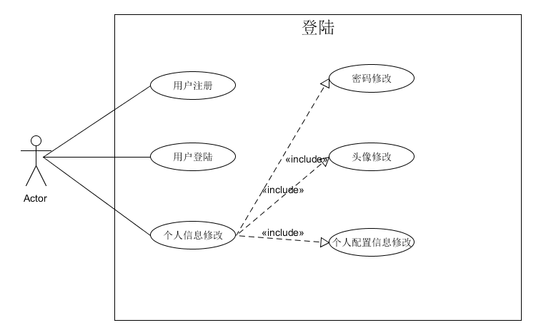
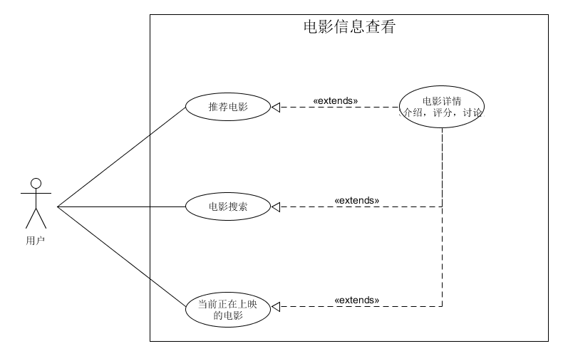
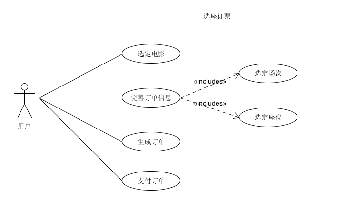
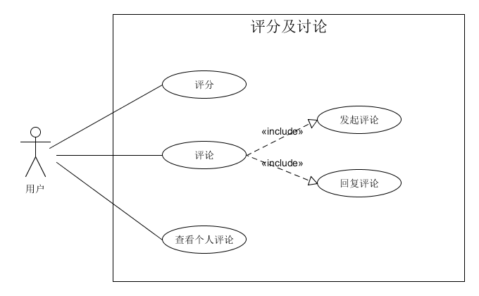

# 软件需求规格说明书

## 1. 引言

### 1.1 目的

本文档将描述BrozeTiki项目的整体结构和功能结构概貌，从总体结构上给出整个系统的轮廓，并对整个应用的功能以及性能需求进行描述。便于用户和开发人员进行沟通交流。

### 1.2 参考文献

[1] <教师报课系统>需求规格说明书，https://wenku.baidu.com/view/b36901336d175f0e7cd184254b35eefdc9d31557.html

[2] 软件需求规格说明书，http://files.cnblogs.com/files/gnoliyuw/%E8%BD%AF%E4%BB%B6%E9%9C%80%E6%B1%82%E8%A7%84%E6%A0%BC%E8%AF%B4%E6%98%8E%E4%B9%A6.pdf

## 2 项目概述

### 2.1 产品描述

开发基于移动端Web平台的程序，实现基础的购票选座功能。为互联网在线购票提供方便快捷的平台。

### 2.2 产品功能

以下通过用例图来描述产品功能。

#### 2.2.1 登录注册

用户注册登陆，登陆后可以修改个人信息，如个人昵称，个人签名等

#### 2.2.2 查看电影信息

用户登陆之后，可以使用应用的搜索功能，通过输入搜索字，可以获取到与搜索词相关联的电影信息，用户可以在首页查看正在上映的电影列表。

#### 2.2.3 选座订票

用户在选定一部正在上映的电影后，通过选定电影院，场次，座位号来生成电影票订单。

#### 2.2.4 评论

用户可以对一部电影进行评分并参加电影内容的相关讨论，也可以发表个人的评论。

### 2.3 用户特点

电影爱好者，喜欢看电影的人群，喜欢分享个人的观影感受。

### 2.4 运行环境

用户通过移动端网页访问，或PC端Chrome浏览器移动端模式访问。

### 2.5 假设和依据

* 前端使用Vue框架开发
* 前后端通过JSON进行数据交互
* 后端使用Python+flask开发

## 3. 系统功能

* 用户登录注册
* 电影推荐
* 电影搜索
* 电影票选场次、选座位
* 生成订单
* 支付订单
* 电影评分，评论
* 用户个人中心

## 4. 非功能需求

### 4.1 安全性需求

权限控制。用户需要完成登录获得权限之后才能够进行购票、收藏和评价等操作。

### 4.2 可维护性

代码需要有较强的可读性，模块划分清晰，功能明确。

## 5. 外部接口需求

### 5.1 硬件接口

无特殊需求

### 5.2 软件接口

无特殊需求

### 5.3 通信接口

使用http协议

### 5.4 用户接口

无特殊需求
